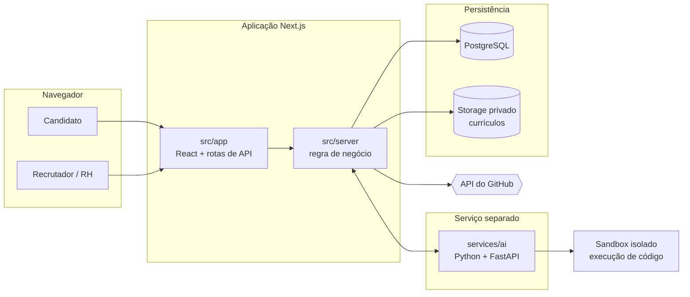

# CLTech — Plataforma de Seleção Automatizada e Inteligente de Talentos

Plataforma web que automatiza o ciclo de recrutamento técnico da **3aq Tecnologia**: da
triagem de currículos até a correção automática de testes de código, com feedback imediato
ao candidato e ranking padronizado para o RH.

> Projeto acadêmico — Curso Superior de Análise e Desenvolvimento de Sistemas
> Faculdade de Tecnologia SENAI Taubaté · 2026 · Prof. Wesley Fioreze

---

## Índice

- [O problema](#o-problema)
- [A solução](#a-solução)
- [Escopo](#escopo)
- [Arquitetura](#arquitetura)
- [Estrutura do repositório](#estrutura-do-repositório)
- [Como rodar](#como-rodar)
- [Documentação](#documentação)
- [Equipe](#equipe)

---

## O problema

A 3aq Tecnologia cresce rápido e contrata programadores continuamente, mas o processo de
recrutamento é manual, lento e descentralizado. Quatro dores concretas:

| Dor | Consequência |
|---|---|
| RH lê centenas de currículos um a um | Bons talentos são descartados por currículo mal escrito, não por falta de competência |
| Programadores sêniores param para corrigir testes técnicos | Os projetos da própria 3aq atrasam |
| Dados de candidatos espalhados em e-mails e pastas | Não há como saber quem já se candidatou antes |
| Cada avaliador tem um critério | A escolha não é justa nem puramente técnica |

## A solução

Um site único onde o candidato se inscreve e o sistema faz o resto: analisa o perfil
automaticamente, aplica um teste de programação que se corrige sozinho e entrega um
relatório mostrando se o candidato sabe programar.

**Benefícios esperados**

- Reduzir em **pelo menos 50%** o tempo entre o anúncio da vaga e a proposta final
- Avaliar todos os candidatos pelos **mesmos critérios objetivos**
- Liberar programadores experientes da correção manual de testes
- Dar **feedback automático e imediato** ao candidato

---

## Escopo

### Requisitos funcionais

| ID | Requisito | Prioridade | Sprint |
|---|---|---|---|
| RF01 | Autenticação e Cadastro | MVP | 1 |
| RF02 | Gestão de Perfil do Candidato | MVP | 1 |
| RF03 | Busca e Candidatura a Vagas | MVP | 1 |
| RF04 | Configuração do Pipeline de Seleção da Vaga | MVP | 2 |
| RF05 | Aplicação de Teste de Código | MVP | 3 |
| RF06 | Correção Automática e Relatório de Desempenho | MVP | 3 |
| RF07 | Painel de Recrutamento (Dashboard Multi-vaga) | MVP | 2 |
| RF08 | Análise Detalhada do Candidato | MVP | 2 |
| RF09 | Busca e Histórico de Candidatos | Desejável | 2 |

### Requisitos não funcionais

`RNF01` Segurança (HTTPS + AES-256) · `RNF02` Disponibilidade 95% · `RNF03` Resposta ≤ 3 s
· `RNF04` Interface responsiva 360 px–1280 px+ · `RNF05` Conformidade com a LGPD ·
`RNF06` Isolamento na execução de código

### Regras de negócio

`RN001` Toda triagem passa pela IA antes do RH · `RN002` Vaga só publica com stack e
requisitos preenchidos · `RN003` **Score da IA é imutável** · `RN004` Dados sensíveis só
para Recrutador/Admin · `RN005` Feedback obrigatório ao candidato · `RN006` Tentativa única
no teste de código · `RN007` Um perfil por e-mail

### Fora de escopo

Instalação local por parte do candidato — a plataforma é 100% navegador.

### Cronograma

| Sprint | Entrega | Foco |
|---|---|---|
| **Sprint 1** | 14/09/2026 | Documentação, modelagem e fundação web: autenticação, perfil e candidatura |
| **Sprint 2** | 26/10/2026 | Motor de triagem (NLP), integração GitHub e painel do recrutador |
| **Sprint 3** | 30/11/2026 | Teste de código, correção automática em sandbox, feedback e LGPD |

---

## Arquitetura

Três camadas, alinhadas às tecnologias exigidas na demanda (React, Node.js e Python para
IA):



### Responsabilidade de cada camada

| Camada | Responsabilidade |
|---|---|
| **`src/app`** | Telas do candidato e do recrutador, editor de código embutido, responsividade, e as rotas de API (casca fina sobre `src/server`) |
| **`src/server`** | Regras de negócio, autenticação e sessão, controle de acesso por papel, criptografia, integração com o GitHub, persistência |
| **`services/ai`** | Extração de texto do currículo, cálculo do score de compatibilidade, correção das submissões de código |

### Decisões de arquitetura

| Decisão | Motivo |
|---|---|
| **Triagem por NLP próprio, sem LLM externo** | Score auditável e reproduzível (exigido pela RN003), currículo nunca sai da infraestrutura (LGPD) e custo zero |
| **Score armazenado como somente-leitura e versionado** | A RN003 exige imutabilidade; correção só por reprocessamento, que cria nova versão |
| **Criptografia seletiva em coluna** | Dados pessoais sensíveis cifrados com AES-256-GCM; e-mail em claro por ser chave de identidade indexável (RN007) |
| **Currículos em bucket privado com URL assinada** | Link vazado não expõe documento de candidato (RN004) |
| **Código de candidato em sandbox sem rede** | Executar código de terceiros é a maior superfície de ataque do produto (RNF06) |
| **Coleta do GitHub degrada em vez de falhar** | API indisponível marca os dados como "Indisponível" e nunca bloqueia a candidatura |

As decisões completas, com as alternativas que foram descartadas e o porquê, estão em
[`specs/001-portal-candidatura/research.md`](specs/001-portal-candidatura/research.md).
As diferenças em relação ao ERS estão em
[`ers-divergences.md`](specs/001-portal-candidatura/ers-divergences.md).

### Princípios inegociáveis

O projeto tem uma [constituição](.specify/memory/constitution.md) com seis princípios. Três
não podem ser flexibilizados por prazo ou conveniência de demonstração:

1. **Privacidade e LGPD por padrão** — dado pessoal cifrado e restrito por papel
2. **Score objetivo e imutável** — nenhuma rota, tela ou operação edita um score emitido
3. **Isolamento na execução de código de terceiros** — sandbox sem rede, sem disco, com limite de tempo

---

## Estrutura do repositório

```text
CLTech/
├── prisma/            Schema, migrações e seed
│   ├── schema.prisma  14 entidades — 9 ativas na Sprint 1, 5 modeladas para as seguintes
│   ├── migrations/    Inclui a trigger de imutabilidade de Evaluation
│   └── seed.ts        Vagas, pipelines e usuários de demonstração
├── src/
│   ├── app/           Telas React (App Router) + rotas de API
│   ├── server/        Regra de negócio testável, sem HTTP
│   ├── components/    UI reutilizável
│   └── lib/           Utilitários compartilhados
├── services/
│   └── ai/            Serviço Python (FastAPI) — triagem por NLP e correção de código
├── tests/             Vitest (unidade/integração) e Playwright (ponta a ponta)
├── docs/              Documentação acadêmica
│   ├── diagramas/     Casos de uso, classes, DER, sequência, atividade
│   ├── prototipo/     Protótipo das interfaces e navegação
│   └── entregas/      Checklists e evidências por sprint
├── specs/             Especificação técnica (Spec Kit)
│   └── 001-portal-candidatura/
│       ├── spec.md               Requisitos da Sprint 1, sem detalhe técnico
│       ├── plan.md               Plano de implementação
│       ├── research.md           Decisões técnicas e alternativas descartadas
│       ├── data-model.md         Entidades, relações e transições de estado
│       ├── ers-divergences.md    Divergências em relação ao ERS, com prazo de ação
│       ├── contracts/api.md      Contratos HTTP
│       └── quickstart.md         Setup e roteiro de validação
└── CLTech - ERS.docx  Especificação de Requisitos de Software
```

A separação entre `src/app/api/` (casca HTTP) e `src/server/` (regra de negócio) é
deliberada: mantém a lógica testável sem subir servidor.

---

## Como rodar

> **Estado atual:** o repositório está na fase de estruturação e documentação da Sprint 1.
> A estrutura e as decisões estão fechadas; o código de aplicação é adicionado ao longo da
> sprint. Os comandos abaixo são o alvo.

### Pré-requisitos

| Ferramenta | Versão | Para quê |
|---|---|---|
| Node.js | 20 LTS ou superior | aplicação Next.js |
| Python | 3.12 ou superior | serviço de IA (Sprint 2) |
| Docker | recente | PostgreSQL local |
| Git | recente | controle de versão |

### 1. Clonar e configurar

```bash
git clone <url-do-repositorio>
cd CLTech
pnpm install
cp .env.example .env      # preencher as variáveis
```

**Variáveis de ambiente**

| Variável | Descrição |
|---|---|
| `DATABASE_URL` | Conexão com o PostgreSQL |
| `AUTH_SECRET` | Assinatura das sessões |
| `ENCRYPTION_KEY` | Chave AES-256 em base64 — gerar com `openssl rand -base64 32` |
| `GITHUB_ID` / `GITHUB_SECRET` | OAuth e coleta de portfólio |
| `STORAGE_*` | Bucket privado de currículos |

Nenhum segredo é versionado. O arquivo `.env` está no `.gitignore`.

### 2. Subir o banco

```bash
docker compose up -d db
```

### 3. Schema e dados de demonstração

```bash
pnpm prisma migrate dev     # cria o schema
pnpm db:seed                # vagas, pipelines e usuários de demonstração
```

### 4. Rodar a aplicação

```bash
pnpm dev                    # http://localhost:3000
```

Uma aplicação só: as telas React e as rotas de API sobem juntas. Não há segundo servidor.

### 5. Serviço de IA (a partir da Sprint 2)

```bash
cd services/ai
python -m venv .venv
source .venv/bin/activate      # Windows: .venv\Scriptsctivate
pip install -r requirements.txt
uvicorn app.main:app --reload  # http://localhost:8000
```

### Testes

```bash
pnpm test          # Vitest — unidade e integração (sobe Postgres efêmero)
pnpm test:e2e      # Playwright — fluxos P1 em 360 px e 1280 px
```

---

## Documentação

| Documento | Conteúdo |
|---|---|
| [ERS](CLTech%20-%20ERS.docx) | Especificação de Requisitos de Software completa |
| [Constituição](.specify/memory/constitution.md) | Princípios técnicos inegociáveis do projeto |
| [Especificação da Sprint 1](specs/001-portal-candidatura/spec.md) | Histórias de usuário, requisitos e critérios de sucesso |
| [Plano de implementação](specs/001-portal-candidatura/plan.md) | Contexto técnico e estrutura de código |
| [Decisões técnicas](specs/001-portal-candidatura/research.md) | O que foi escolhido, o que foi descartado e por quê |
| [Divergências do ERS](specs/001-portal-candidatura/ers-divergences.md) | Onde a implementação difere do ERS, por quê e o que precisa ser emendado |
| [Modelo de dados](specs/001-portal-candidatura/data-model.md) | Entidades, relações e transições de estado |
| [Contratos de API](specs/001-portal-candidatura/contracts/api.md) | Rotas HTTP e regras de erro |
| [Diagramas](docs/diagramas/) | Casos de uso, classes, DER e sequência |

---

## Equipe

| Integrante |
|---|
| Cassiano Luiz Brandes Soares |
| Davi Ferreira da Cunha |
| Guilherme Emanuel Gonçalves |
| João Vitor Charleaux |
| Pedro Henrique Dias Brito |
| Vinícius Rodrigues Vilaça |

**Orientação:** Prof. Wesley Fioreze
**Demanda:** 3aq Tecnologia — via SAGA
**Instituição parceira:** Centro de Formação Profissional Wanderillo de Castro Câmara (CE)
